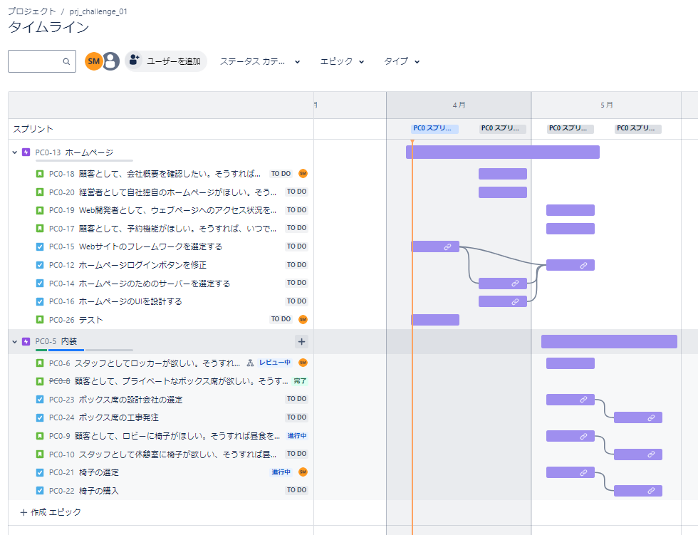
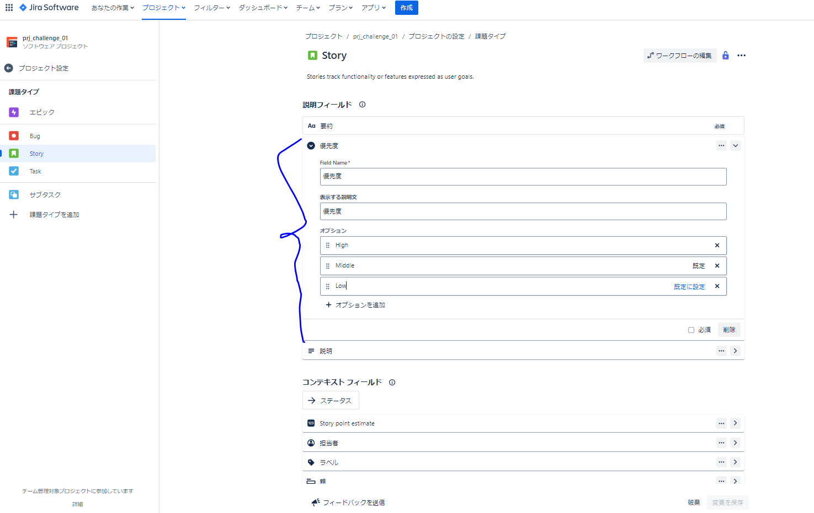
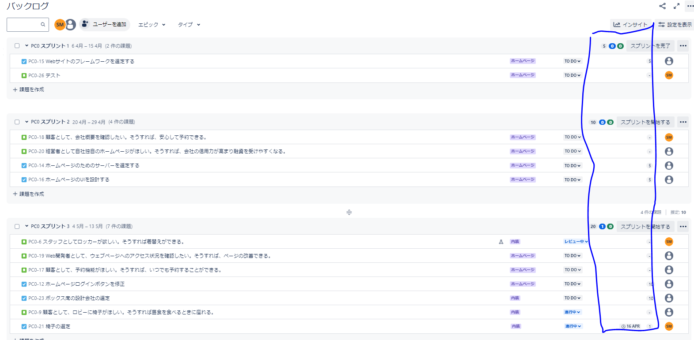
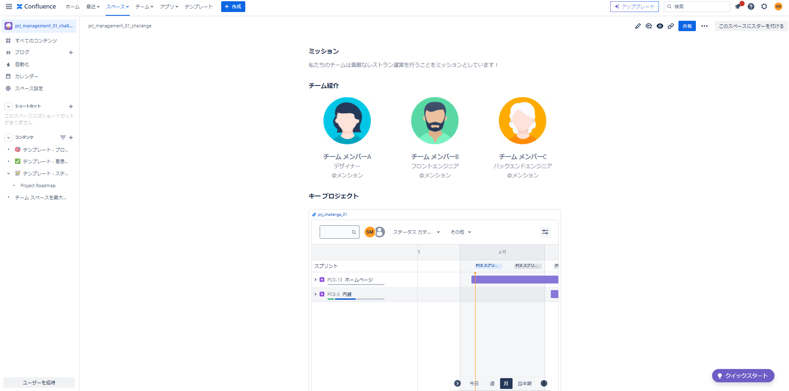
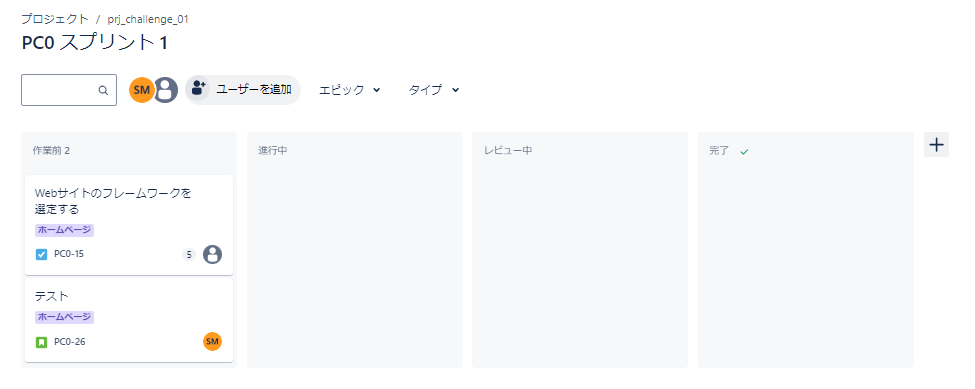
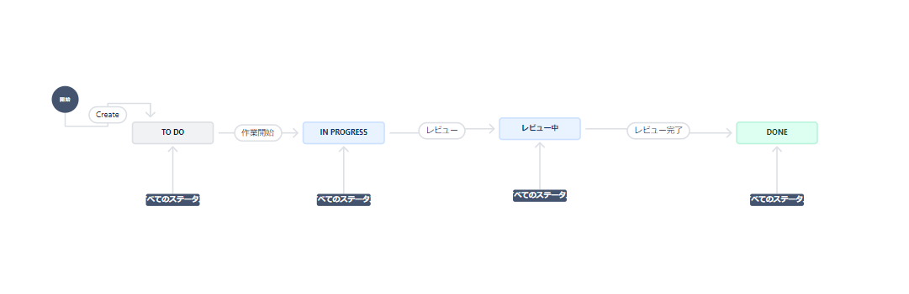
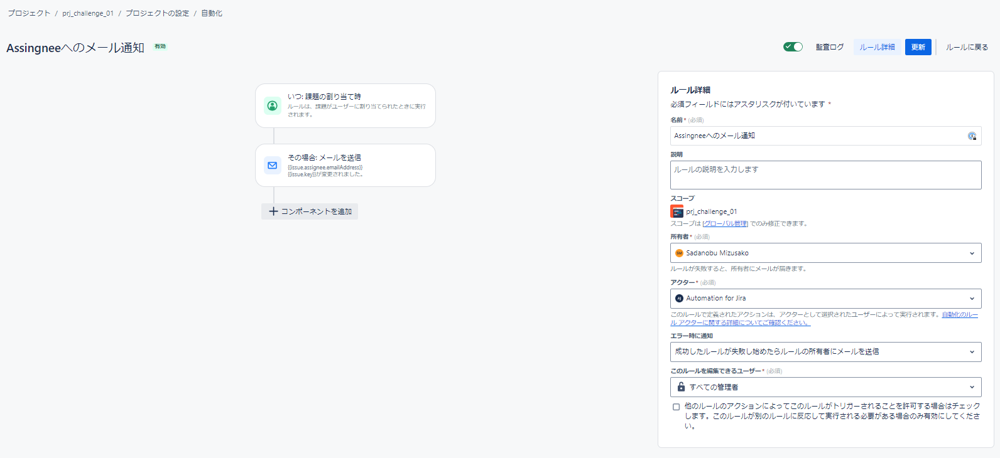
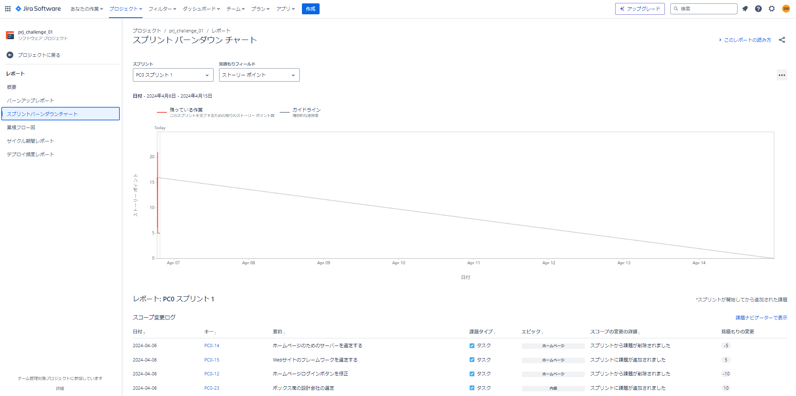

# 要件とスクリーンショットの関係

## 標準レベルの要件

- プロジェクトボードを用意します。
- 2つ以上のエピックを作成します。
- 各エピックには、2つ以上のストーリーと4つ以上のタスクが必要です。
- エピック、ストーリー、タスクをリンクさせます (どのようにリンクするかは自由です)。

- エピック、ストーリー、タスクのいずれか (複数でも可) にカスタムの項目を1つ追加します。
- 各ストーリーに優先度を追加します (優先度の項目がない場合は、ストーリーをカスタマイズする必要があります)。※発展レベルの要件

- タスクのストーリーポイントを見積ります。

  
## 発展レベルの要件

- デフォルトのテンプレートを使ってConfluenceのページを作成します。

- ボードに新しい列を追加します。新しい列を使用するためにボードのワークフローも修正してください。

- 2つ以上の自動化ルールをゼロから作成します。プロジェクトに適した自動化であればどのようなものでもよいです。

- ボードの「レポート」機能を有効にしてバーンダウンチャートを使えるようにします (データは表示されません。データを生成するにはスプリントを開始する必要があるためです)。
